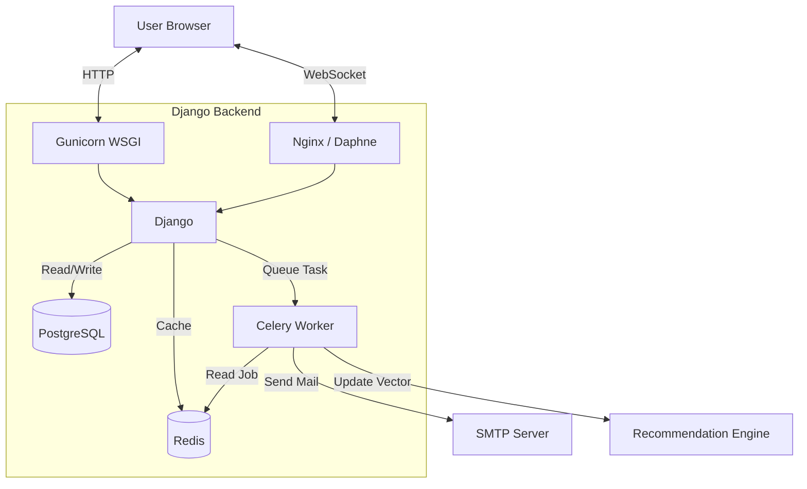
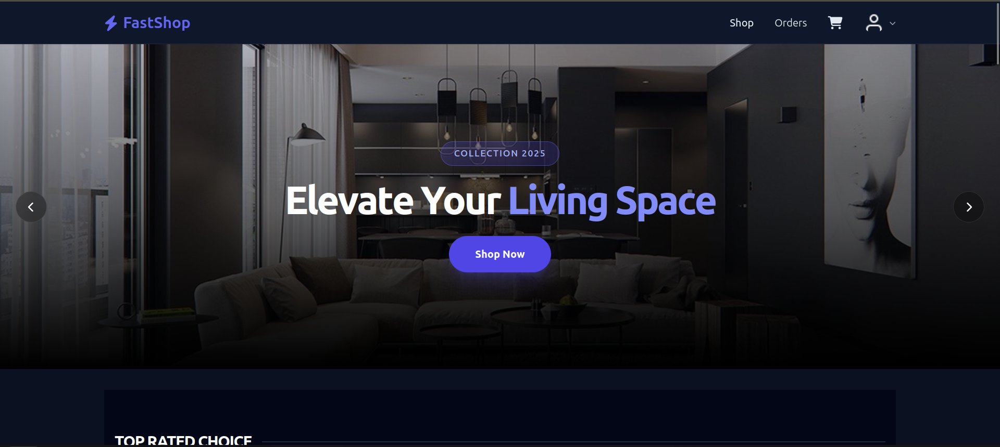
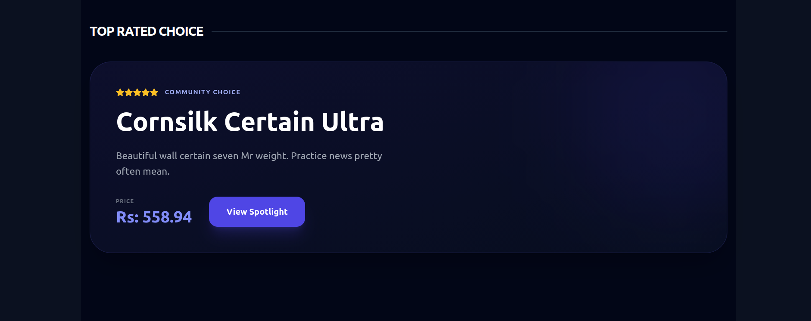
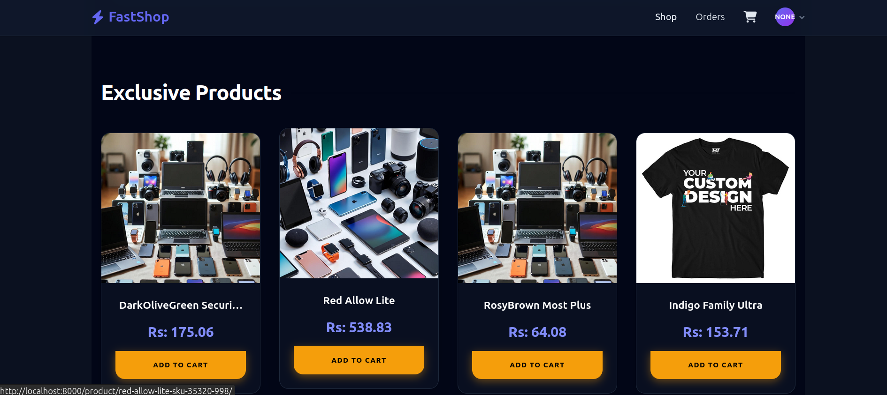
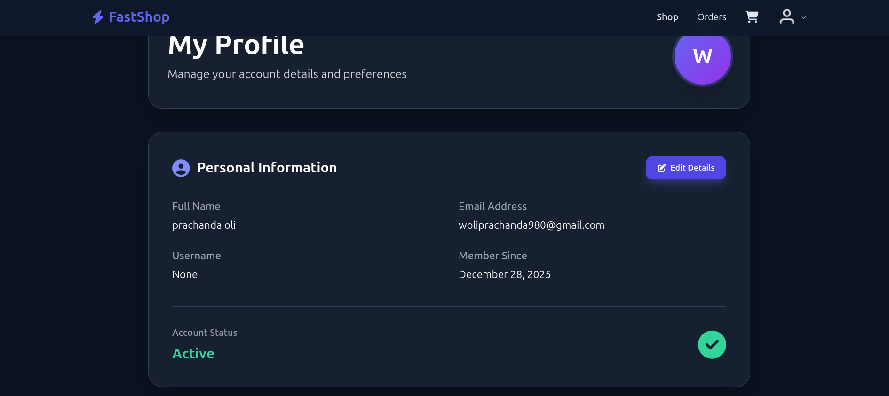
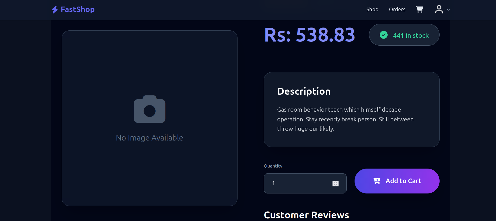
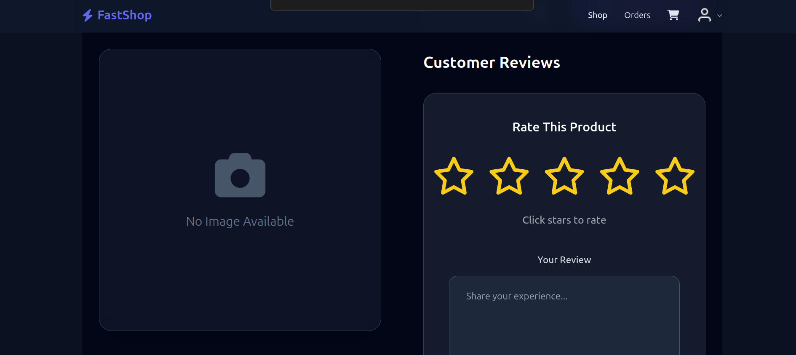

# Django High-Performance E-Commerce

A robust e-commerce system built with Django designed to handle high-traffic sales events. It features database-level concurrency control, real-time inventory updates via WebSockets, and an intelligent recommendation engine.

## 🌟 Features

### 🔒 Concurrency & Inventory Safety
- **Row-Level Locking**: Uses `select_for_update()` to prevent race conditions.
- **Atomic Transactions**: Ensures strict data consistency during checkout.
- **Oversell Protection**: Guarantees zero overselling even during flash sales with 1000+ concurrent users.

### ⚡ Real-Time Interactions
- **Live Stock Updates**: WebSockets (Django Channels) push inventory changes instantly to all connected clients.
- **Dynamic UI**: "Add to Cart" buttons disable immediately across all browsers when stock hits zero.
- **Notifications**: Real-time alerts for connection status and cart updates.

### 🧠 Intelligent Recommendations
- **Content-Based Filtering**: Suggests products using TF-IDF Vectorization and Cosine Similarity.

### ⭐ Reviews & Social Proof
- **Verified Reviews**: Logic ensures only users who purchased a product can rate it.
- **Interactive UI**: Responsive star rating system optimized for mobile and desktop.
- **Aggregated Scores**: Real-time calculation of average product ratings.

### 📧 Async Notifications
- **Celery Task Queue**: Offloads heavy email sending to background workers.
- **Transactional Emails**: Automated confirmations for Orders and Shipping status via SMTP (Gmail).
- **Redis Broker**: Fast and reliable message passing for background tasks.

## 🛠 Technology Stack

- **Backend**: Django 4.2, Python 3.11
- **Database**: PostgreSQL 14 (Production), SQLite (Dev)
- **Real-time**: Django Channels 4, Daphne
- **Caching & Broker**: Redis 7
- **Tasks**: Celery 5
- **ML Engine**: Scikit-learn, NumPy
- **Frontend**: HTML5, Tailwind CSS, Alpine.js
- **Containerization**: Docker, Docker Compose

## 🏗 System Architecture



## 🚀 Installation & Setup

### Option 1: Docker (Recommended)

1. **Clone the repository**
   ```bash
   git clone <your-repo-url>
   cd django_ecommerce
   ```

2. **Configure Environment**
   Create a `.env` file in the root directory:
   ```env
   DEBUG=True
   SECRET_KEY=secure-random-key
   ALLOWED_HOSTS=*
   DATABASE_URL=postgres://user:pass@db:5432/ecommerce_db
   REDIS_URL=redis://redis:6379/1
   CELERY_BROKER_URL=redis://redis:6379/0
   EMAIL_HOST_USER=your-email@gmail.com
   EMAIL_HOST_PASSWORD=your-app-password
   ```

3. **Build and Run**
   ```bash
   docker-compose up --build
   ```
   
4. **Access the App**
   - Storefront: http://localhost:8000
   - Admin: http://localhost:8000/admin (Create superuser via `docker-compose exec web python manage.py createsuperuser`)

### Option 2: Local Manual Setup

1. **Install Dependencies**
   ```bash
   python -m venv venv
   source venv/bin/activate  # Windows: venv\Scripts\activate
   pip install -r requirements.txt
   ```

2. **Services**
   - Ensure PostgreSQL is running.
   - Ensure Redis is running (`redis-server`).

3. **Run Migrations & Server**
   ```bash
   python manage.py migrate
   python manage.py runserver
   ```

4. **Run Celery (in separate terminal)**
   ```bash
   celery -A django_ecommerce worker --loglevel=info
   ```

## 🧪 Testing & Simulation

**Load Testing (Flash Sale)**:
Uses `locust` to simulate hundreds of users buying the same item simultaneously to prove concurrency safety.
```bash
locust -f tests/locustfile.py
```

**Unit Tests**:
```bash
python manage.py test apps.orders
python manage.py test apps.products
```

## 📦 Deployment (Render/Docker Hub)

1. **Build Image**:
   ```bash
   docker build --platform linux/amd64 -t username/fastshop:latest .
   docker push username/fastshop:latest
   ```

2. **Deploy on Render**:
   - Create Web Service -> "Deploy from Registry".
   - Image: `docker.io/username/fastshop:latest`
   - Add Env Vars (DATABASE_URL provided by Render).
## 📸 Screenshots







## 🎥 Demo Video

[![Watch the Demo]](demo/demovideo.mp4)

_Click the image above to watch the demo video_